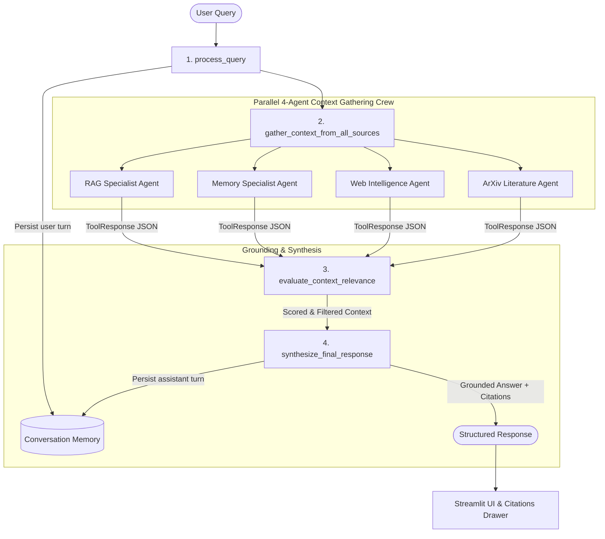

# Multi-Agent Context Engineering Research Assistant

A multi-agent research assistant that solves complex analytical queries by assembling, auditing, and synthesizing context across **four independent sources in parallel**:
1. **Document Vector RAG** (uploaded PDF vector index)
2. **Session Memory** (thread-scoped conversation history)
3. **Live Web Search** (real-time news and public developments)
4. **Academic/Domain API** (structured scientific literature from ArXiv)

Unlike standard single-source RAG chatbots, this architecture tackles the core challenge of **Context Engineering**: systematically assembling heterogeneous context, passing it through an **Evaluator Agent** that drops irrelevant data and isolates failed APIs, and passing only verified context to a **Synthesizer Agent** that enforces factual groundedness with pinpoint citations.

---

## Architecture Overview



---

## Key Differentiators & Engineering Highlights

| Feature | Engineering Implementation | Why it matters |
|---|---|---|
| **Parallel Context Gathering** | 4 context-gathering tools run concurrently in a thread pool / Crew execution. | Total context retrieval latency = $\max(\text{latency of individual sources})$, not their sum. |
| **Error Isolation** | Any source failure (e.g. invalid web key or network timeout) produces a standardized `ERROR` envelope. | The evaluator excludes the failed source; the remaining sources still answer the query. |
| **Strict Anti-Hallucination** | If context is inadequate across all sources, the synthesizer returns `INSUFFICIENT_CONTEXT` ($confidence = 0.0$). | Prohibits models from answering from parametric memory on missing data. |
| **Uniform Response Contract** | Every tool returns a strictly validated JSON shape (`status`, `source_used`, `answer`, `citations`, `confidence`). | Agents treat all sources uniformly without brittle ad-hoc parsing. |
| **Audit Trail in UI** | Streamlit UI displays a collapsible "Sources & Citations" drawer with per-source status pills and evaluator reasoning. | Turns black-box generation into an auditable research dossier. |

---

## Quickstart Guide

### 1. Prerequisites
- Python 3.10+
- (Optional) API keys for Gemini, Voyage AI, or Web Search (the system includes deterministic local fallbacks for offline testing).

### 2. Setup Virtual Environment
```bash
# Clone the repository
git clone <repo-url>
cd context-workflow

# Create virtual environment
python -m venv .venv

# Activate virtual environment
# On Windows (PowerShell):
.venv\Scripts\Activate.ps1
# On Linux/macOS:
source .venv/bin/activate

# Install dependencies
pip install -r requirements.txt
```

### 3. Configure Environment Variables
Copy `.env.example` to `.env` and enter your preferred API credentials:
```bash
cp .env.example .env
```

| Key | Used By | Required? |
|---|---|---|
| `GEMINI_API_KEY` | Grounded synthesizer & Gemini LLM | Optional (local fallback included) |
| `VOYAGE_API_KEY` | Voyage contextualized embeddings | Optional (local deterministic fallback included) |
| `WEB_SEARCH_API_KEY` | Tavily / Firecrawl web search | Optional (pipeline degrades gracefully without it) |

### 4. Launch the Streamlit Interface
```bash
streamlit run app.py
```
1. In the sidebar, upload the provided sample document: `data/sample_research_paper.pdf`.
2. Wait for the 4-step progress bar (Uploaded $\rightarrow$ Parsed $\rightarrow$ Embedded $\rightarrow$ Indexed).
3. Ask questions in the chat pane and inspect the **Sources & Citations** drawer under each answer.

---

## Running the Automated Test Suite

The test suite covers unit tests, schema contracts, error isolation, and hallucination defenses:

```bash
# Run all tests
pytest -v
```

### Test Coverage Highlights:
- `tests/test_config_loader.py`: YAML parsing, agent/task configuration retrieval.
- `tests/test_rag_pipeline.py`: PDF extraction, vector store indexing, similarity search.
- `tests/test_memory.py`: Sentence-boundary truncation, thread session isolation.
- `tests/test_external_clients.py`: Missing web search key handling, ArXiv XML parsing.
- `tests/test_tools.py`: Universal `ToolResponse` contract validation.
- `tests/test_evaluator.py`: Error isolation and refusal on empty context.
- `tests/test_flow.py`: Full 4-stage pipeline execution.
- `tests/test_error_isolation.py`: Pipeline resilience when web search errors.
- `tests/test_groundedness.py`: Strict anti-hallucination defense for unanswerable queries.

---

## Project Structure

```
context-workflow/
├── src/
│   ├── document_processing/     # PDF parsing, section extraction, and chunking
│   │   ├── doc_parser.py
│   │   └── schemas.py
│   ├── rag/                     # Embeddings client, vector database, RAG pipeline
│   │   ├── embeddings.py
│   │   ├── retriever.py
│   │   └── rag_pipeline.py
│   ├── memory/                  # Session-scoped conversation memory & truncation
│   │   ├── memory.py
│   │   └── truncation.py
│   ├── tools/                   # CrewAI tool wrappers & uniform response contracts
│   │   ├── external_api_client.py
│   │   ├── external_api_tool.py
│   │   ├── memory_tool.py
│   │   ├── rag_tool.py
│   │   ├── schemas.py
│   │   ├── web_search_client.py
│   │   └── web_search_tool.py
│   ├── workflows/               # Agents, tasks, parallel crew, and 4-stage flow
│   │   ├── agents.py
│   │   ├── crews.py
│   │   ├── evaluator.py
│   │   ├── flow.py
│   │   └── tasks.py
│   ├── generation/              # Synthesizer grounding engine & response schemas
│   │   ├── generation.py
│   │   └── schemas.py
│   ├── ui/                      # Streamlit components (sidebar, chat, citations drawer)
│   │   ├── chat.py
│   │   ├── citations_drawer.py
│   │   ├── session.py
│   │   └── sidebar.py
│   └── config/                  # YAML configuration loader
│       └── config_loader.py
├── config/
│   ├── agents/agents.yaml       # Agent roles, goals, and backstories
│   └── tasks/tasks.yaml         # Task descriptions and expected outputs
├── data/
│   ├── sample_research_paper.pdf
│   └── README.md
├── tests/                       # Complete pytest suite (27 tests)
├── app.py                       # Streamlit web application entry point
├── pyproject.toml
├── requirements.txt
├── .env.example
├── .gitignore
├── prd.md
└── tasks.md
```

---

## Known v1 Scoping Limitations

1. **PDF Format Only**: Document parsing currently targets PDF documents (using `pypdf` with section-based chunking).
2. **Session-Scoped Vector Index**: Vector collections are initialized per session (drop-and-recreate mode); incremental document updates are earmarked for v2.
3. **Session Memory**: Conversation memory is persisted per `(user_id, thread_id)` with reset functionality; cross-session persistence across browser reboots can be attached via Zep Cloud or external SQLite volume.

---

## Documentation & Additional Guides

- 📘 **[Comprehensive How-To-Use Guide](file:///g:/Data%20Analytics/19.Portfolio/context-workflow/HOW_TO_USE.md)**: Detailed step-by-step handbook covering architecture concepts, API key setup, 1-click sample document ingestion, query patterns, and troubleshooting.
- 🧪 **[Full Test Results Report](file:///g:/Data%20Analytics/19.Portfolio/context-workflow/TEST_RESULTS.md)**: Complete test matrix, live API verification (Gemini, Voyage, Firecrawl), and browser session trace.
- 🔍 **[Root Cause Analysis & Architecture Iterations](file:///g:/Data%20Analytics/19.Portfolio/context-workflow/ROOT_CAUSE_ANALYSIS.md)**: Engineering audit documenting bug fixes, API format changes, and resilience measures.

