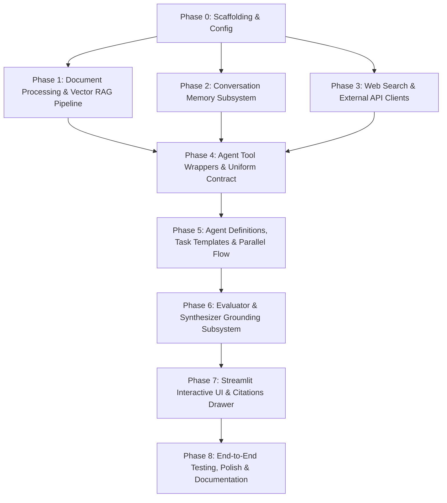

# Tasks: Multi-Agent Context Engineering Research Assistant

This document outlines the atomic, phased execution tasks required to build the Multi-Agent Context Engineering Research Assistant according to [prd.md](file:///g:/Data%20Analytics/19.Portfolio/context-workflow/prd.md).

Tasks are strictly ordered by dependency. Each phase unlocks subsequent phases. Each task contains explicit file targets, implementation requirements, dependencies, and atomic verification criteria.

---

## Dependency Graph Overview

---

## Phase 0: Project Scaffolding, Environment & Configuration Layer

**Goal:** Establish the directory structure, dependency management via `uv`, environment variable contract, and centralized configuration loading.

- [x] **TASK-001: Initialize Directory Tree & Package Structure**
  - **Path:** `src/`, `src/document_processing/`, `src/rag/`, `src/memory/`, `src/generation/`, `src/tools/`, `src/workflows/`, `src/config/`, `config/agents/`, `config/tasks/`, `data/`, `outputs/`
  - **Action:**
    - Create all project directories.
    - Create `__init__.py` files for all packages under `src/` to ensure re-exports and clean top-level imports.
  - **Dependencies:** None
  - **Verification:** Run `python -c "import src"` and verify directory tree exists.

- [x] **TASK-002: Create Dependency Manifest & Environment Config**
  - **Path:** `pyproject.toml`, `.env.example`, `.gitignore`
  - **Action:**
    - Define `pyproject.toml` with project metadata and dependencies: `crewai`, `crewai-tools`, `pydantic>=2.0`, `milvus-lite` (or `pymilvus`), `voyageai`, `openai`, `streamlit`, `requests`, `pyyaml`, `python-dotenv`, `pytest`.
    - Create `.env.example` defining keys: `DOC_PARSER_API_KEY`, `EMBEDDINGS_API_KEY`, `LLM_API_KEY`, `MEMORY_API_KEY`, `WEB_SEARCH_API_KEY`.
    - Create `.gitignore` ignoring `.env`, `outputs/`, `__pycache__/`, `.venv/`, vector DB storage files (`*.db`, `*.milvus`).
  - **Dependencies:** TASK-001
  - **Verification:** Execute `uv pip compile pyproject.toml` or `uv sync` to confirm dependency resolution.

- [x] **TASK-003: Implement Centralized YAML Config Loader**
  - **Path:** `src/config/config_loader.py`, `src/config/__init__.py`
  - **Action:**
    - Implement `ConfigLoader` class with methods `load_yaml(path: Path) -> dict`, `get_agent_config(agent_name: str) -> dict`, and `get_task_config(task_name: str) -> dict`.
    - Raise clear `KeyError` or `FileNotFoundError` when a configuration or key is missing.
    - Re-export `ConfigLoader` in `src/config/__init__.py`.
  - **Dependencies:** TASK-001, TASK-002
  - **Verification:** Write a unit test asserting `ConfigLoader` loads a dummy YAML file and raises `KeyError` for non-existent agent names.

- [x] **TASK-004: Define Agent & Task Configuration Files**
  - **Path:** `config/agents/agents.yaml`, `config/tasks/tasks.yaml`
  - **Action:**
    - In `config/agents/agents.yaml`, define profiles (`role`, `goal`, `backstory`, `verbose`) for: `rag_agent`, `memory_agent`, `web_search_agent`, `external_api_agent`, `evaluator_agent`, `synthesizer_agent`.
    - In `config/tasks/tasks.yaml`, define task specs (`description` with format placeholders, `expected_output`) for: `rag_task`, `memory_task`, `web_search_task`, `external_api_task`, `evaluate_context_task`, `synthesize_response_task`.
  - **Dependencies:** TASK-003
  - **Verification:** Verify `ConfigLoader.get_agent_config("rag_agent")` and `ConfigLoader.get_task_config("rag_task")` return valid non-empty dictionaries.

---

## Phase 1: Document Processing & Vector RAG Pipeline

**Goal:** Ingest PDFs, extract structured document metadata and section chunks, compute contextualized embeddings, store them in a local vector database, and perform similarity retrieval (FR-101 to FR-106).

- [x] **TASK-101: Define Document Schema & Extraction Models**
  - **Path:** `src/document_processing/schemas.py`
  - **Action:**
    - Define Pydantic models for structured document extraction according to PRD §7.1: `Section(heading, summary)`, `StructuredDocument(title, authors, abstract, keywords, key_findings, sections)`.
    - Define chunk schema: `DocumentChunk(text, page_number, chunk_index, source_file)`.
  - **Dependencies:** TASK-002
  - **Verification:** Validate sample JSON payloads against `StructuredDocument` and `DocumentChunk`.

- [x] **TASK-102: Implement Document Parser & Chunker**
  - **Path:** `src/document_processing/doc_parser.py`, `src/document_processing/__init__.py`
  - **Action:**
    - Implement `DocumentParser` supporting PDF extraction.
    - If `DOC_PARSER_API_KEY` is present, support API-based structured parsing (TensorLake / LlamaParse / DocAI).
    - Provide a robust local fallback (e.g. `pypdf`/`PyMuPDF` + regex section chunking) when API keys are absent or during offline testing.
    - Ensure chunks carry `{text, page_number, chunk_index, source_file}` (FR-102).
    - Raise an exception if parsing yields zero chunks.
  - **Dependencies:** TASK-101
  - **Verification:** Parse a sample PDF in `data/` and assert returned `List[DocumentChunk]` has length > 0 with valid metadata.

- [x] **TASK-103: Implement Contextualized Embeddings Wrapper**
  - **Path:** `src/rag/embeddings.py`, `src/rag/__init__.py`
  - **Action:**
    - Implement `EmbeddingsClient` wrapping Voyage AI (`voyage-context-3`) or OpenAI embeddings (`text-embedding-3-small`).
    - Provide `embed_documents(chunks: List[str]) -> List[List[float]]` (batch contextualized embedding, FR-103).
    - Provide `embed_query(query: str) -> List[float]` (query-specific embedding, FR-105).
    - Expose `dimension: int` attribute (e.g., 1024 or 1536).
  - **Dependencies:** TASK-002
  - **Verification:** Embed a test batch of 2 strings and 1 query string; assert vector length equals `dimension`.

- [x] **TASK-104: Implement Milvus Lite Vector Store Client**
  - **Path:** `src/rag/retriever.py`
  - **Action:**
    - Implement `VectorStoreClient` using Milvus Lite (local file store, e.g. `./outputs/milvus_demo.db`).
    - Implement schema according to PRD §7.4 (`id`, `embedding`, `text`, `page_number`, `chunk_index`, `source_file`).
    - Implement collection initialization with drop-and-recreate mode per session (FR-104).
    - Implement `insert_chunks(chunks: List[DocumentChunk], embeddings: List[List[float]])`.
    - Implement `search(query_embedding: List[float], top_k: int = 5) -> List[dict]` returning matched chunks with similarity scores.
  - **Dependencies:** TASK-101, TASK-103
  - **Verification:** Insert 3 mock vectors, run a query search, and verify returned results include scores and original chunk metadata.

- [x] **TASK-105: Implement End-to-End RAG Pipeline**
  - **Path:** `src/rag/rag_pipeline.py`, `src/rag/__init__.py`
  - **Action:**
    - Implement `RAGPipeline` composing `DocumentParser`, `EmbeddingsClient`, and `VectorStoreClient`.
    - Implement `process_documents(file_paths: List[str]) -> int` (returns chunk count).
    - Implement `retrieve_context(query: str, top_k: int = 5) -> List[dict]`.
    - If collection has no documents, return empty list gracefully (FR-106).
  - **Dependencies:** TASK-102, TASK-103, TASK-104
  - **Verification:** Run a standalone script processing a sample PDF, execute a search query, and assert retrieved text matches document content.

---

## Phase 2: Conversation Memory Subsystem

**Goal:** Provide conversation turn tracking, intelligent sentence/word boundary truncation, session scoping by user/thread, and contextual synthesis (FR-201 to FR-205).

- [x] **TASK-201: Implement Sentence-Boundary Truncation Utility**
  - **Path:** `src/memory/truncation.py`
  - **Action:**
    - Implement `truncate_text(text: str, max_length: int = 500) -> str` (FR-202).
    - Truncate at nearest sentence boundary (`.`, `?`, `!`); fallback to nearest whitespace; fallback to hard slice if no boundary exists.
  - **Dependencies:** TASK-001
  - **Verification:** Test truncation with long multi-sentence strings, ensuring no words or punctuation are broken unnaturally.

- [x] **TASK-202: Implement Thread-Scoped Memory Manager**
  - **Path:** `src/memory/memory.py`, `src/memory/__init__.py`
  - **Action:**
    - Implement `MemoryManager` supporting `(user_id, thread_id)` isolation (FR-205).
    - Implement backend storage: Zep client if `MEMORY_API_KEY` is provided, with a local in-memory/SQLite store fallback for offline/local-first operation.
    - Implement `save_turn(role: str, name: str, message: str)` with automatic truncation for assistant replies (FR-201, FR-202).
    - Implement `get_context(query: str) -> Optional[str]` that returns a consolidated context block or `None` if no turns exist (FR-203, FR-204).
  - **Dependencies:** TASK-201
  - **Verification:** Save 3 user/assistant turns in thread `A` and assert thread `B` returns no context; verify thread `A` retrieves synthesized or recent turns.

---

## Phase 3: Web Search & External API Integration

**Goal:** Implement resilient connectors for live web search and external academic/domain APIs, adhering to the standardized envelope and error isolation (FR-301 to FR-403).

- [x] **TASK-301: Implement Web Search Client**
  - **Path:** `src/tools/web_search_client.py`
  - **Action:**
    - Implement `WebSearchClient` supporting Firecrawl or Tavily API using `WEB_SEARCH_API_KEY` (FR-301).
    - If `WEB_SEARCH_API_KEY` is missing or invalid, return a disabled state rather than throwing an exception (FR-303).
    - Implement `search(query: str, max_results: int = 5) -> List[dict]`, truncating snippets to a bounded length (e.g., 300 chars).
  - **Dependencies:** TASK-002
  - **Verification:** Test search with and without API key; confirm graceful fallback dict with empty/disabled status when key is absent.

- [x] **TASK-302: Implement External Domain API Client (ArXiv)**
  - **Path:** `src/tools/external_api_client.py`
  - **Action:**
    - Implement `ArXivClient` utilizing the public ArXiv Atom/REST API (no API key required, FR-401).
    - Support query search with optional field filters (title, author, abstract).
    - Parse XML/Atom response into normalized records: `{title, authors, abstract, url, published_date, category}` (FR-402).
    - Enforce a request timeout and handle network failures gracefully.
  - **Dependencies:** TASK-002
  - **Verification:** Execute a query for `"context engineering"` and assert parsed fields exist and match expected schemas.

---

## Phase 4: Uniform Tool Response Contract & Agent Tool Wrappers

**Goal:** Wrap all 4 context sources into CrewAI-compatible tools that strictly adhere to the universal JSON response envelope (FR-501 to FR-503).

- [x] **TASK-401: Define Universal Tool Response Models**
  - **Path:** `src/tools/schemas.py`
  - **Action:**
    - Define Pydantic models:
      - `Citation(label: str, locator: str)`
      - `ToolResponse(status: Literal["OK", "INSUFFICIENT_CONTEXT", "ERROR"], source_used: Literal["RAG", "MEMORY", "WEB", "ARXIV", "EXTERNAL_API"], answer: str, citations: List[Citation], confidence: float, details: Dict[str, Any] = {})`
    - Enforce validation rules: `confidence == 0.0` if `status != "OK"`; `citations` must default to empty list `[]`, never `None` (FR-501, FR-502, FR-503).
  - **Dependencies:** TASK-002
  - **Verification:** Validate valid OK response and error response against `ToolResponse.model_validate_json()`.

- [x] **TASK-402: Implement RAG Tool Wrapper**
  - **Path:** `src/tools/rag_tool.py`, `src/tools/__init__.py`
  - **Action:**
    - Implement `RAGTool` inheriting from CrewAI's `BaseTool`.
    - Integrate with `RAGPipeline.retrieve_context(query)`.
    - Format citations with `{label: chunk['source_file'], locator: f"Page {chunk['page_number']}"}`.
    - If index is empty or top score is below threshold, return status `INSUFFICIENT_CONTEXT` (FR-106).
    - Output must be serialized JSON conforming to `ToolResponse`.
  - **Dependencies:** TASK-105, TASK-401
  - **Verification:** Execute `RAGTool._run("test query")` on an empty and populated index; verify JSON string conforms to `ToolResponse`.

- [x] **TASK-403: Implement Memory Tool Wrapper**
  - **Path:** `src/tools/memory_tool.py`
  - **Action:**
    - Implement `MemoryTool` inheriting from CrewAI's `BaseTool`.
    - Call `MemoryManager.get_context(query)`.
    - If no relevant history found, return status `INSUFFICIENT_CONTEXT` (FR-204).
    - On success, format `citations` as `[{label: "Conversation History", locator: f"Thread {thread_id}"}]` and return `ToolResponse` JSON.
  - **Dependencies:** TASK-202, TASK-401
  - **Verification:** Invoke `MemoryTool._run("query")` on empty history and assert `status == "INSUFFICIENT_CONTEXT"`.

- [x] **TASK-404: Implement Web Search Tool Wrapper**
  - **Path:** `src/tools/web_search_tool.py`
  - **Action:**
    - Implement `WebSearchTool` inheriting from CrewAI's `BaseTool`.
    - Call `WebSearchClient.search(query)`.
    - If key missing or call fails, return `status="ERROR"` or `"INSUFFICIENT_CONTEXT"` with error message in `answer`, never raising unhandled exceptions (FR-302, FR-303).
    - Format citations with `{label: result['title'], locator: result['url']}`.
    - Output must be serialized JSON conforming to `ToolResponse`.
  - **Dependencies:** TASK-301, TASK-401
  - **Verification:** Simulate missing API key and verify tool outputs valid JSON with `status="ERROR"`, `confidence=0.0`.

- [x] **TASK-405: Implement External API Tool Wrapper**
  - **Path:** `src/tools/external_api_tool.py`
  - **Action:**
    - Implement `ExternalAPITool` (or `ArXivTool`) inheriting from CrewAI's `BaseTool`.
    - Call `ArXivClient.search(query)`.
    - Format citations with `{label: paper['title'], locator: paper['url']}`.
    - Return `INSUFFICIENT_CONTEXT` if 0 results, `ERROR` on exception, `OK` with confidence score on match (FR-403).
    - Output must be serialized JSON conforming to `ToolResponse`.
  - **Dependencies:** TASK-302, TASK-401
  - **Verification:** Run `ExternalAPITool._run("deep learning")` and assert returned JSON complies with `ToolResponse`.

---

## Phase 5: Multi-Agent Orchestration & Parallel Flow State Machine

**Goal:** Configure CrewAI agents and tasks via YAML, instantiate the 4-agent parallel context collection crew, and build the stateful Flow pipeline (FR-601, FR-602).

- [x] **TASK-501: Implement Agent Factory**
  - **Path:** `src/workflows/agents.py`, `src/workflows/__init__.py`
  - **Action:**
    - Implement `create_agent(agent_key: str, tools: List[BaseTool] = [], llm: Any = None) -> Agent`.
    - Read `role`, `goal`, `backstory`, and `verbose` from `ConfigLoader.get_agent_config(agent_key)` (FR-601).
    - Expose factory functions for all 6 agents: `create_rag_agent()`, `create_memory_agent()`, `create_web_agent()`, `create_external_api_agent()`, `create_evaluator_agent()`, `create_synthesizer_agent()`.
  - **Dependencies:** TASK-004, TASK-402, TASK-403, TASK-404, TASK-405
  - **Verification:** Instantiate all agents and assert attributes match `agents.yaml`.

- [x] **TASK-502: Implement Task Factory**
  - **Path:** `src/workflows/tasks.py`
  - **Action:**
    - Implement `create_task(task_key: str, agent: Agent, context: Optional[List[Task]] = None, **kwargs) -> Task`.
    - Interpolate runtime variables (e.g. `{query}`, `{raw_context}`) into task `description` templates from `tasks.yaml` (FR-601).
  - **Dependencies:** TASK-004, TASK-501
  - **Verification:** Create `rag_task` with `{query: "hello"}` and assert interpolated string contains "hello".

- [x] **TASK-503: Implement Parallel Context Gathering Crew**
  - **Path:** `src/workflows/crews.py`
  - **Action:**
    - Implement `create_context_gathering_crew(query: str, tools: dict) -> Crew`.
    - Bundle the 4 context agents (`rag_agent`, `memory_agent`, `web_search_agent`, `external_api_agent`) and their corresponding tasks into one crew.
    - Set execution to concurrent/parallel execution (FR-602) to ensure context collection latency equals the slowest single source.
  - **Dependencies:** TASK-501, TASK-502
  - **Verification:** Run context gathering crew on a test query; assert execution logs show parallel task execution and outputs from all 4 agents.

---

## Phase 6: Evaluator & Synthesizer Grounding Subsystem

**Goal:** Filter and score raw context outputs against strict JSON schemas, enforce error isolation, and synthesize grounded responses with citation trails (FR-603 to FR-606).

- [x] **TASK-601: Define Evaluator & Generation Schemas**
  - **Path:** `src/generation/schemas.py`, `src/generation/__init__.py`
  - **Action:**
    - Define `ContextEvaluationResult` Pydantic model (PRD §7.2):
      - `relevant_sources: List[str]`
      - `filtered_context: Dict[str, Any]`
      - `relevance_scores: Dict[str, float]`
      - `reasoning: str`
    - Define `FinalSynthesizedResponse` model:
      - `status: Literal["OK", "INSUFFICIENT_CONTEXT"]`
      - `answer: str`
      - `citations: List[Citation]`
      - `confidence: float`
      - `missing: List[str]`
  - **Dependencies:** TASK-401
  - **Verification:** Validate sample evaluator and synthesizer JSON objects against schemas.

- [x] **TASK-602: Implement Evaluator Task Dynamic Builder & Schema Parser**
  - **Path:** `src/workflows/evaluator.py`
  - **Action:**
    - Implement `build_evaluator_task(evaluator_agent: Agent, query: str, raw_sources: Dict[str, ToolResponse]) -> Task` (FR-603).
    - Interpolate formatted JSON payloads of all 4 source results into task description.
    - Implement `parse_evaluation_output(output_text: str) -> ContextEvaluationResult`.
    - Include resilient JSON regex/markdown extraction fallback if LLM output contains surrounding text (FR-604).
    - Enforce business logic: sources with `status == "ERROR"` must NEVER be in `relevant_sources`, but must be acknowledged in `reasoning` (FR-605).
  - **Dependencies:** TASK-501, TASK-601
  - **Verification:** Test parser with valid JSON, markdown-wrapped JSON, and malformed strings; ensure fallback works and ERROR sources are excluded.

- [x] **TASK-603: Implement Synthesizer Task & Grounding Engine**
  - **Path:** `src/generation/generation.py`, `src/generation/__init__.py`
  - **Action:**
    - Implement `build_synthesizer_task(synthesizer_agent: Agent, query: str, filtered_context: ContextEvaluationResult) -> Task`.
    - Ensure only `filtered_context` is passed, never raw data (FR-606).
    - If `relevant_sources` is empty or all sources failed, configure prompt to strictly output `status="INSUFFICIENT_CONTEXT"` without fabricating facts (FR-204, Non-functional Groundedness).
    - Implement response parser converting final output into `FinalSynthesizedResponse`.
  - **Dependencies:** TASK-501, TASK-601, TASK-602
  - **Verification:** Run synthesis with empty context; verify output status is `INSUFFICIENT_CONTEXT` with `confidence=0.0` and no hallucinations.

- [x] **TASK-604: Assemble Complete 4-Stage Research Flow**
  - **Path:** `src/workflows/flow.py`
  - **Action:**
    - Implement `ResearchAssistantFlow` orchestrating the 4 stages from PRD §4.1:
      1. `process_query`: persist user turn to memory (FR-201).
      2. `gather_context_from_all_sources`: run the 4-agent parallel crew (FR-602).
      3. `evaluate_context_relevance`: evaluate raw outputs and build filtered context (FR-603, FR-604).
      4. `synthesize_final_response`: generate final grounded response and save assistant turn to memory (FR-201, FR-606).
    - Return a consolidated dictionary containing `{answer, citations, evaluation: ContextEvaluationResult, raw_sources}`.
  - **Dependencies:** TASK-202, TASK-503, TASK-602, TASK-603
  - **Verification:** Run a complete terminal script running `ResearchAssistantFlow.kickoff(query="...")` end-to-end and inspect output structure.

---

## Phase 7: Streamlit Interactive UI & Citations Drawer

**Goal:** Create a responsive, professional Streamlit web application with document uploading, pipeline progress tracking, chat interaction, and an inspectable citations drawer (FR-701 to FR-705).

- [x] **TASK-701: Implement Session State & Assistant Lifecycle Manager**
  - **Path:** `src/ui/session.py`
  - **Action:**
    - Manage Streamlit `st.session_state` keys: `messages`, `rag_pipeline`, `flow`, `indexed_documents`, `session_id`.
    - Implement clean initialization and chat reset functionality without re-indexing documents (FR-704).
  - **Dependencies:** TASK-105, TASK-604
  - **Verification:** Simulate session state setup and reset; ensure message list clears while keeping `rag_pipeline` intact.

- [x] **TASK-702: Implement Document Ingestion Sidebar Component**
  - **Path:** `src/ui/sidebar.py`
  - **Action:**
    - Build sidebar upload widget supporting PDF files (FR-701).
    - Implement multi-step visual progress: Uploaded → Parsed → Embedded → Indexed.
    - Show badge/status indicator for assistant readiness and list currently indexed document names.
  - **Dependencies:** TASK-105, TASK-701
  - **Verification:** Launch Streamlit, upload a sample PDF, and verify progress indicators advance and documents register in session state.

- [x] **TASK-703: Implement Chat Interface Component**
  - **Path:** `src/ui/chat.py`
  - **Action:**
    - Render chat message history (`st.chat_message("user")` and `st.chat_message("assistant")`).
    - Disable/block chat input with a guiding banner when no document has been indexed yet (FR-702).
    - On submission, trigger `ResearchAssistantFlow` with a spinner indicator.
  - **Dependencies:** TASK-604, TASK-701
  - **Verification:** Verify chat input is disabled when 0 documents exist; verify prompt submission appends user message to history.

- [x] **TASK-704: Implement Collapsible Sources & Citations Drawer**
  - **Path:** `src/ui/citations_drawer.py`
  - **Action:**
    - For each assistant message, render an expander `"Sources & Citations"` (FR-703).
    - Display relevance overview: used sources, confidence scores, and evaluator reasoning text.
    - Render expandable cards per source with colored status pills: Green for `OK`, Amber for `INSUFFICIENT_CONTEXT`, Red for `ERROR`.
    - Display locator citations (Page X or URL).
    - Implement fallback debug expander if data is malformed so the UI never crashes (FR-705).
  - **Dependencies:** TASK-601, TASK-703
  - **Verification:** Feed mock malformed evaluation results into drawer renderer and confirm page renders error expander without throwing.

- [x] **TASK-705: Assemble Main Streamlit Application Entry Point**
  - **Path:** `app.py`
  - **Action:**
    - Wire `src/ui/sidebar.py`, `src/ui/chat.py`, and `src/ui/citations_drawer.py` together in `app.py`.
    - Set page config: title, layout="wide", favicon.
    - Add custom CSS styling for high aesthetic polish and clean card layouts.
  - **Dependencies:** TASK-701, TASK-702, TASK-703, TASK-704
  - **Verification:** Execute `streamlit run app.py` and interactively verify sidebar upload, query submission, and citations drawer display.

---

## Phase 8: End-to-End Testing, Validation & Documentation

**Goal:** Verify all acceptance criteria, validate groundedness and error isolation, add sample documents, and document setup (PRD §12).

- [x] **TASK-801: Automated Integration Tests for Error Isolation & Missing Keys**
  - **Path:** `tests/test_error_isolation.py`
  - **Action:**
    - Test pipeline when `WEB_SEARCH_API_KEY` is omitted or invalid.
    - Confirm Web agent returns `ERROR`/`INSUFFICIENT_CONTEXT`, the other 3 sources function, and final answer is produced without exceptions (PRD Acceptance Criterion 4).
  - **Dependencies:** TASK-604
  - **Verification:** Run `pytest tests/test_error_isolation.py` and assert passing tests.

- [x] **TASK-802: Automated Groundedness & Hallucination Defense Tests**
  - **Path:** `tests/test_groundedness.py`
  - **Action:**
    - Run query for completely absent information against a known document.
    - Assert that status returned is `INSUFFICIENT_CONTEXT` and the model does not answer from parametric memory (PRD Acceptance Criterion 3).
  - **Dependencies:** TASK-604
  - **Verification:** Run `pytest tests/test_groundedness.py` and verify zero hallucinations reported.

- [x] **TASK-803: Provide Sample Test Documents**
  - **Path:** `data/sample_research_paper.pdf`, `data/README.md`
  - **Action:**
    - Place a sample PDF document in `data/` for immediate demo and recruitment test runs.
    - Document sample queries: one query found in document, one query requiring web search, one conversational reference, and one unanswerable query.
  - **Dependencies:** TASK-001
  - **Verification:** Confirm sample PDF is readable by `DocumentParser`.

- [x] **TASK-804: Create Comprehensive Project README**
  - **Path:** `README.md`
  - **Action:**
    - Write complete README containing:
      - Project overview and portfolio value proposition (Context Engineering).
      - Architecture diagram (Mermaid flow).
      - 5-minute quickstart guide (`uv sync`, `.env` setup, `streamlit run app.py`).
      - Minimum viable API key matrix.
      - Sample queries and expected behavior screenshots/traces.
      - Explicit v1 limitations (PDF only, session-scoped memory, drop-and-recreate index).
  - **Dependencies:** TASK-705, TASK-801, TASK-802, TASK-803
  - **Verification:** Review README for completeness against PRD §12.
